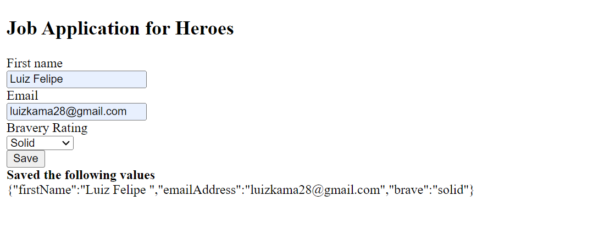

# **Relatório sobre Formulários Dinâmicos em Angular**

## Tecnologia e Conceitos

O Angular é um framework para construção de aplicações web desenvolvido pela Google. Ele oferece uma abordagem modular e orientada a componentes para criar interfaces de usuário robustas e dinâmicas. Uma das características poderosas do Angular é a manipulação eficiente de formulários, permitindo a criação de formulários dinâmicos que se ajustam às necessidades específicas da aplicação.

### Conceitos Aprendidos:

1. **FormGroup e FormArray:**
   - `FormGroup` é utilizado para agrupar e gerenciar controles de formulário.
   - `FormArray` é uma extensão do `FormGroup` para lidar com grupos dinâmicos de controles.

2. **Criação Dinâmica de Controles:**
   - A capacidade de adicionar, remover e atualizar controles de formulário dinamicamente, proporcionando flexibilidade aos formulários.

3. **ngSwitch para Formulários Condicionais:**
   - O uso de `ngSwitch` para alternar entre conjuntos de campos de formulário com base em condições específicas.

4. **Componentes Reutilizáveis:**
   - A importância de criar componentes reutilizáveis para facilitar a manutenção e escalabilidade do código.

5. **Integração com Dados Externos:**
   - Como preencher formulários dinâmicos com dados provenientes de fontes externas, como APIs.

## Execução do Passo a Passo

### Passo 1: Criação do FormGroup e FormArray

```typescript
// Criação do FormGroup
this.myForm = this.fb.group({
  // ...outros controles estáticos
  dynamicControls: this.fb.array([]),
});
```

### Passo 2: Adição Dinâmica de Controles

```typescript
// Adição de um controle ao FormArray
const newControl = this.fb.control(''); // Pode ser qualquer controle
this.dynamicControls.push(newControl);
```

### Passo 3: Uso de ngSwitch para Formulários Condicionais

```html
<div [ngSwitch]="condition">
  <div *ngSwitchCase="'case1'"> <!-- campos específicos para case1 --> </div>
  <div *ngSwitchCase="'case2'"> <!-- campos específicos para case2 --> </div>
  <div *ngSwitchDefault> <!-- campos padrão --> </div>
</div>
```

### Passo 4: Componentes Reutilizáveis

Criar componentes reutilizáveis para campos específicos do formulário.

### Passo 5: Integração com Dados Externos

```typescript
// Preenchendo dados externos no formulário
this.myForm.patchValue({
  dynamicControls: ['valor1', 'valor2', 'valor3'],
});
```

## Prints da Execução

### Terminal (Comando: `ng serve`)


### Navegador (Formulário Dinâmico em Execução)

